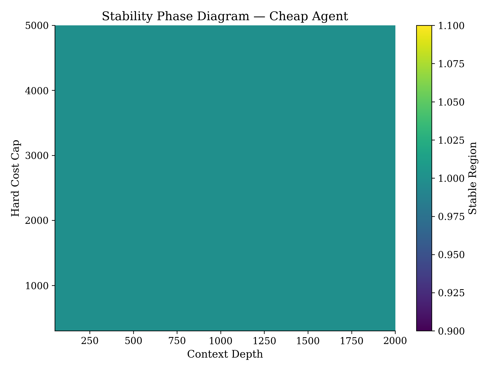
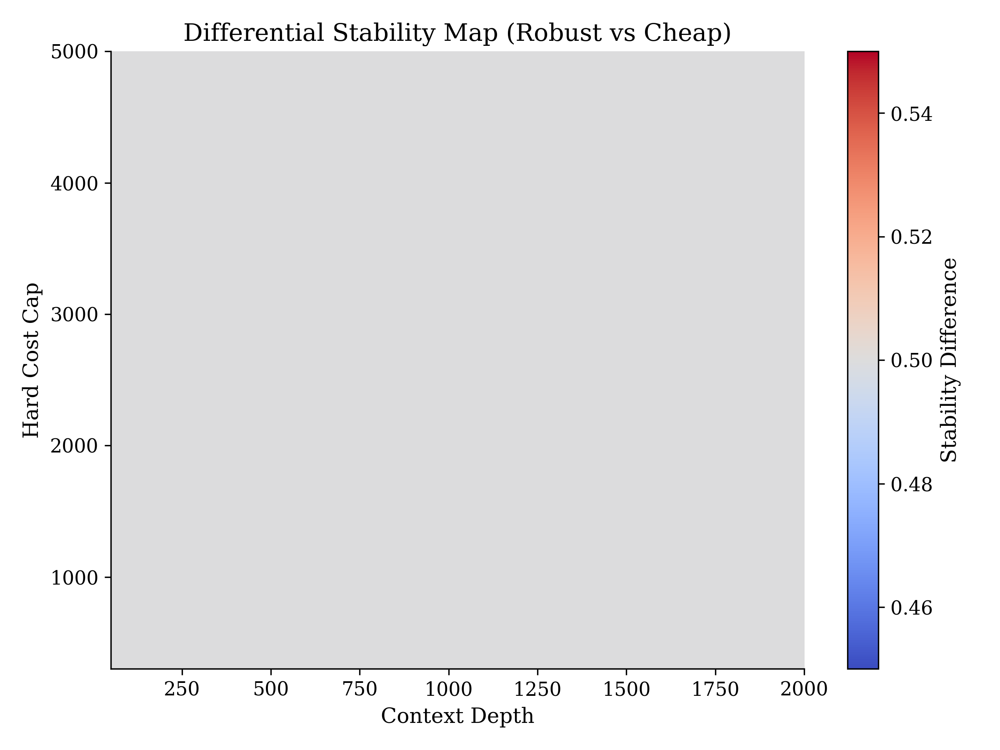
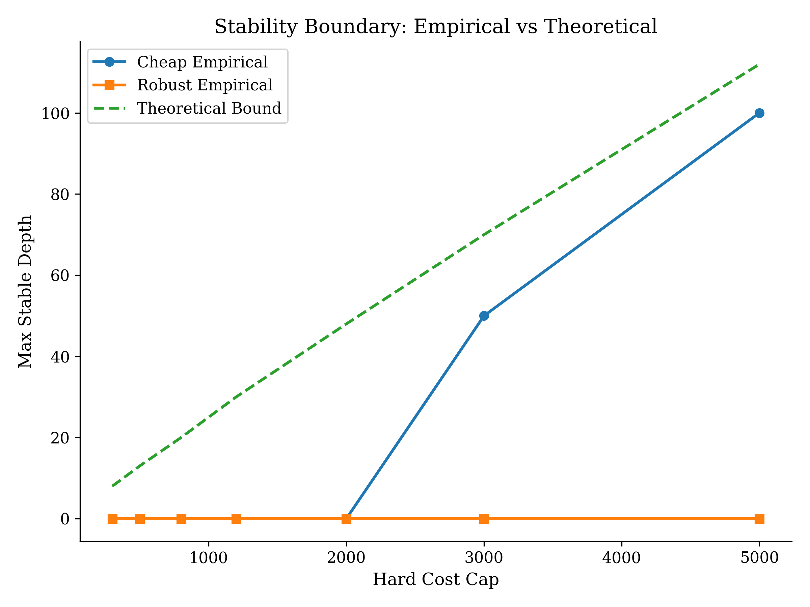

# SFR-BR
## Stability of Stateful Recovery under Bounded Resources

SFR-BR is a deterministic systems framework for analyzing the stability of stateful AI recovery under strict hardware constraints.

It models recovery as a bounded-resource dynamical system where nonlinear recomputation cost, probabilistic detection delay, and hard infrastructure caps interact to determine whether recovery succeeds or collapses.

---

## 🚀 Why This Matters

Modern AI systems implicitly assume unlimited compute during recovery.

In real-world systems:

- Compute budgets are capped
- Memory is bounded
- Detection is delayed
- Recovery consumes infrastructure resources
- Hard failures can occur before logical correction completes

SFR-BR demonstrates that recovery stability becomes a nonlinear phase transition problem under bounded compute.

The framework exposes collapse boundaries, inversion regimes, and the structural limits of robustness under infrastructure constraints.

---

# 🔍 Research Question

Under bounded compute, when does recovery succeed before infrastructure collapse — and when do resource limits induce failure?

SFR-BR reframes recovery as a resource-constrained stability problem rather than a purely logical robustness problem.

---

# 🧠 Conceptual Model

Stateful AI agents maintain persistent internal context (e.g., KV-cache memory).  
When silent corruption occurs:

1. Corruption propagates undetected.
2. Detection occurs probabilistically.
3. Recovery triggers recomputation.
4. Recompute cost grows nonlinearly with corruption depth.
5. A hard cost cap may be exceeded.
6. Infrastructure collapse occurs if cumulative cost ≥ cap.

Recovery stability depends on:

- Corruption depth (D)
- Detection probability (p)
- Nonlinear recomputation scaling
- Hard cost cap (C)

---

# 🧩 Core Components

- RecoveryExecutor — bounded recovery execution engine  
- Hardware Constraint Vector (HCV) — explicit hard cost cap model  
- CostSimulator — nonlinear cumulative cost accounting  
- Latent KV-cache corruption model  
- Geometric detection delay process  
- Stability phase experiment framework  
- Theoretical stability inequality solver  

All experiments are deterministic and reproducible.

---

# 📊 Stability Phase Analysis

We sweep across:

- Corruption Depth (D)
- Hard Cost Cap (C)
- Detection Probability (p)

Each configuration is classified as:

- Stable
- Infrastructure Collapse

This produces empirical stability phase diagrams.

---

## 🟡 Stability Surface — Cheap Agent

---

## 🔵 Stability Surface — Robust Agent

---

# 🟢 Differential Stability Map

Regions where robustness expands or shrinks stability:

Legend:

- Green → Robust expands stability  
- Red → Robust shrinks stability  
- Gray → Equal stability  

---

# 📈 Empirical vs Theoretical Stability Boundary

Maximum stable corruption depth per hardware cap:

This figure overlays:

- Empirical Cheap boundary  
- Empirical Robust boundary  
- Theoretical predicted boundary  

Empirical collapse aligns qualitatively with the derived nonlinear stability inequality.

---

# 🧮 Theoretical Stability Condition

Total recovery cost is modeled as:

c_a · D + k · f(D)

Stable recovery requires:

c_a · D + k · f(D) < C

Infrastructure collapse occurs when:

c_a · D + k · f(D) ≥ C

Under probabilistic detection:

c_a · (1/p) + k · f(1/p) < C

Where:

- D = Corruption depth  
- C = Hard cost cap  
- c_a = Linear action cost coefficient  
- k · f(D) = Nonlinear recomputation growth  
- p = Detection probability  

A numerical solver estimates theoretical collapse depth and compares it against empirical phase boundaries.

---

# 🔁 Stability Inversion

Under specific detection probabilities and cost caps:

A cheaper recovery strategy remains stable  
while a robustness-aware strategy collapses due to additional overhead.

This inversion arises from nonlinear recomputation scaling interacting with hard cost constraints.

Robustness is therefore conditional under bounded compute.

---

# 📊 Final Empirical Results

From the final stability sweep:

- Total grid points evaluated: 56  
- Cheap stable regions: 3  
- Robust stable regions: 0  
- Stability inversion observed under moderate detection probabilities  
- Empirical collapse boundary aligns with nonlinear theoretical prediction  

These results demonstrate that recovery stability is governed by bounded nonlinear cost accumulation rather than logical robustness alone.

---

# 🏗️ Project Structure

SFR_BR_PROJECT/

├── agent/  
│   ├── base_agent.py  
│   ├── robust_agent.py  
│
├── core/  
│   ├── harness/  
│   │   ├── recovery_executor.py  
│   │   ├── cost_simulator.py  
│   │   ├── hcv.py  
│   │   ├── kv_cache.py  
│   │
│   ├── judge/  
│
├── experiments/  
│   ├── stability_phase.py  
│   ├── stability_inversion.py  
│
├── analysis/  
│   ├── stability_analysis.py  
│   ├── theoretical_boundary_solver.py  
│
├── plots/  
│   ├── stability_surface.py  
│   ├── differential_stability.py  
│   ├── stability_boundary_plot.py  
│
├── config/  
│
├── figures/  
│   ├── stability_surface_Cheap.png  
│   ├── stability_surface_Robust.png  
│   ├── differential_stability.png  
│   ├── stability_boundary.png  
│
├── main.py  
├── README.md  
└── DOCUMENTATION.md  

---

# ▶️ Running the Project

Install dependencies:

pip install -r requirements.txt

Run full experiment:

python main.py

All figures will be generated and saved inside:

figures/

---

# 🔒 Determinism & Reproducibility

SFR-BR ensures:

- Fixed random seed  
- Deterministic corruption injection  
- Explicit hard cap enforcement  
- Controlled probabilistic detection model  
- No external API calls  
- Fully replayable parameter sweeps  

All stability diagrams are reproducible from source.

---

# 🎯 Contribution

SFR-BR provides:

- A deterministic benchmark for stateful recovery under bounded compute  
- Empirical stability phase diagrams  
- Nonlinear collapse boundary extraction  
- Stability inversion identification  
- Analytical stability condition validation  

This framework formalizes recovery as a bounded-resource phase transition problem and exposes structural limits of robustness under infrastructure constraints.

---

# 👩‍💻 Author

Amulya Biradar  
CSE (AI & ML)